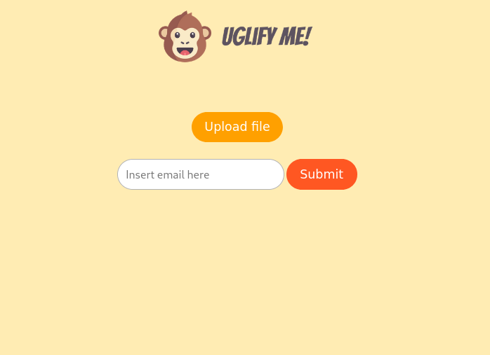

# Uglify Me!

This is my experimental project to use computer vision as a feature of a website. I use OpenCV library with C++ to process the image and Python Flask to make the REST API and Email Service.

<div align="center">
  
</div>

## Requirements

* [OpenCV](https://docs.opencv.org/master/df/d65/tutorial_table_of_content_introduction.html)
* [Linux](https://www.linux.org/pages/download/)
* [C++](http://www.cplusplus.org/)
* [Python 3.7+](https://www.python.org/)
* [Gmail account](https://www.google.com/intl/id/gmail/about/)

## How to use

### Installation

#### Quick Installation

The easiest way to try this program is by using [Podman](https://podman.io/getting-started/installation) or [Docker](https://docs.docker.com/get-docker/)

```sh
git clone https://github.com/KY64/Uglify-Me.git
cd Uglify-Me
```

* **Podman**

```sh
podman build -t uglify:1.0 .
podman run -dt --name uglify-me -e PORT=5000 -e SENDER_EMAIL=account@mail.com -e SPICY=email_password -p 5000:5000 uglify:1.0
```

* **Docker**

```sh
docker build -t uglify:1.0 .
docker run -dt --name uglify-me -e PORT=5000 -e SENDER_EMAIL=account@mail.com -e SPICY=email_password -p 5000:5000 uglify:1.0
```

#### Alternative Installation

Currently, I'm using Fedora to try this program so for those who uses another Linux Distro might need to find out the package name.


```sh
dnf install -y cmake g++ wget unzip python3-pip \
    gtk3-devel gstreamer1-devel clutter-devel \
    && wget -O opencv.zip https://github.com/opencv/opencv/archive/master.zip \
    && unzip opencv.zip && mkdir -p build && cd build \
    && cmake  ../opencv-master \
    && cmake --build . \
    && cmake --build . --target install \
    && cd ../ \
    && pip install -r requirements.txt \
    && cd processor \
    && cmake . \
    && make
```

### Sending Email

To send email using your Gmail account, you must [Allow less secure apps](https://myaccount.google.com/lesssecureapps). You can find more about it [here](https://realpython.com/python-send-email/)
